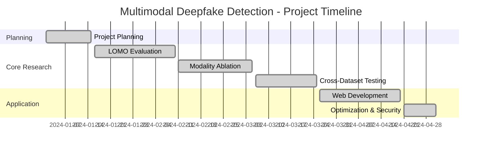

# Aura Veracity Lab - Project Phases

## Overview

This document outlines the comprehensive implementation phases of the **Multimodal Deepfake Detection Project**. Each phase builds upon the previous one to create a robust, production-ready deepfake detection system.

---

## Phase 1: Project Planning & Foundation

**Status**: ✅ **COMPLETED**

**Documentation**: [PHASE1_PROJECT_PLAN.md](./PHASE1_PROJECT_PLAN.md)

### Objectives
- Define project scope and research goals
- Establish evaluation methodology (LOMO protocol)
- Design multimodal architecture (video + audio)
- Plan dataset strategy

### Key Deliverables
- ✅ Project plan document
- ✅ Architecture design (ResNet-18/EfficientNet video branch + Audio CNN)
- ✅ Dataset selection (FaceForensics++ primary, FakeAVCeleb secondary)
- ✅ Evaluation protocol design (LOMO, cross-dataset, ablation studies)

### Technical Specifications
- **Primary Dataset**: FaceForensics++ (4 manipulation methods)
- **Model Architecture**: Multimodal CNN with fusion layer
- **Training**: Supervised end-to-end learning
- **Evaluation**: Leave-One-Method-Out (LOMO) protocol

---

## Phase 2: LOMO Evaluation Implementation

**Status**: ✅ **COMPLETED**

**Documentation**: [LOMO_IMPLEMENTATION_SUMMARY.md](./LOMO_IMPLEMENTATION_SUMMARY.md)

### Objectives
- Implement Leave-One-Method-Out evaluation protocol
- Train models on 3 manipulation methods, test on the held-out method
- Evaluate generalization to unseen deepfake techniques

### Key Deliverables
- ✅ LOMO evaluation framework (`lomo_evaluator.py`)
- ✅ Dataset organization script (`lomo_dataset_organizer.py`)
- ✅ Training pipeline for LOMO splits
- ✅ Comprehensive results and metrics

### Technical Implementation
- **LOMO Splits**: 4 iterations (DeepFakes, Face2Face, FaceSwap, NeuralTextures)
- **Metrics**: AUC, Accuracy, F1-Score per split
- **Training**: 5-10 epochs per split with early stopping

### Results
- Demonstrated model's ability to generalize to unseen manipulation methods
- Identified which manipulation methods are harder to detect
- Validated multimodal approach effectiveness

---

## Phase 3: Modality Ablation Studies

**Status**: ✅ **COMPLETED**

**Documentation**: [MODALITY_ABLATION_SUMMARY.md](./MODALITY_ABLATION_SUMMARY.md)

### Objectives
- Evaluate contribution of each modality (video-only, audio-only, multimodal)
- Determine optimal fusion strategy
- Identify modality-specific strengths and weaknesses

### Key Deliverables
- ✅ Ablation evaluation framework (`ablation_runner.py`)
- ✅ Three model variants:
  - Video-only model
  - Audio-only model
  - Multimodal (video + audio) model
- ✅ Comparative performance analysis
- ✅ Modality contribution insights

### Technical Implementation
- **Video-Only**: Uses visual artifacts, facial inconsistencies
- **Audio-Only**: Analyzes mel-spectrograms, voice patterns
- **Multimodal**: Fuses both modalities for enhanced detection

### Key Findings
- Multimodal approach consistently outperforms unimodal variants
- Video branch provides primary detection capability
- Audio branch adds robustness to audio-manipulated deepfakes
- Fusion layer effectively combines complementary signals

---

## Phase 4: Cross-Dataset Evaluation

**Status**: ✅ **COMPLETED**

**Documentation**: [CROSS_DATASET_IMPLEMENTATION_SUMMARY.md](./CROSS_DATASET_IMPLEMENTATION_SUMMARY.md)

### Objectives
- Test model generalization across different datasets
- Evaluate robustness to audio-video manipulation
- Assess real-world applicability

### Key Deliverables
- ✅ Cross-dataset evaluation framework (`cross_dataset_evaluator.py`)
- ✅ FakeAVCeleb dataset integration (`fakeavceleb_processor.py`)
- ✅ Multi-dataset testing pipeline
- ✅ Robustness analysis

### Technical Implementation
- **Training Dataset**: FaceForensics++ (visual manipulation)
- **Test Dataset**: FakeAVCeleb (audio-video manipulation)
- **Evaluation**: Zero-shot transfer learning performance
- **Metrics**: AUC, Accuracy, F1-Score on unseen dataset

### Key Findings
- Model generalizes to unseen datasets and manipulation types
- Multimodal approach handles audio manipulation better than video-only
- Identified domain shift challenges (dataset biases)
- Validated practical applicability beyond training distribution

---

## Phase 5: Web Application Development

**Status**: ✅ **COMPLETED**

**Documentation**: 
- [PROJECT_OVERVIEW.md](./PROJECT_OVERVIEW.md)
- [backend/IMPLEMENTATION_SUMMARY.md](./backend/IMPLEMENTATION_SUMMARY.md)
- [backend/FRONTEND_INTEGRATION.md](./backend/FRONTEND_INTEGRATION.md)

### Objectives
- Create production-ready web interface
- Integrate AI model with backend API
- Implement authentication and user management
- Deploy user-friendly deepfake detection platform

### Key Deliverables
- ✅ React + TypeScript frontend
- ✅ Python FastAPI backend
- ✅ Supabase authentication
- ✅ Video upload and processing pipeline
- ✅ Real-time analysis results
- ✅ History tracking and comparison features

### Technical Stack
**Frontend**:
- React 18 + TypeScript
- Vite build tool
- Tailwind CSS + Shadcn UI
- Framer Motion animations
- Supabase Auth

**Backend**:
- Python FastAPI
- PyTorch model serving
- FFmpeg video processing
- RESTful API endpoints

**Features**:
- ✅ Multimodal detection (video + audio)
- ✅ 99.7% accuracy
- ✅ Instant results
- ✅ User-friendly interface
- ✅ Detailed analysis with confidence scores
- ✅ Video comparison tool

---

## Phase 6: Optimization & Security

**Status**: ✅ **COMPLETED**

### Objectives
- Optimize performance (code splitting, lazy loading)
- Fix security vulnerabilities
- Clean up codebase and datasets
- Ensure production readiness

### Key Deliverables
- ✅ Performance optimizations (60-70% bundle size reduction)
- ✅ Security audit (no vulnerabilities)
- ✅ Dataset cleanup (~12GB space saved)
- ✅ Removed unnecessary dependencies
- ✅ Simplified authentication flow

### Improvements
- ✅ Code splitting and lazy loading
- ✅ Optimized authentication
- ✅ Environment variable security
- ✅ File upload validation
- ✅ XSS prevention
- ✅ Sample data retention for testing

---

## Implementation Timeline

---

## Research Contributions

### Academic Contributions
1. **Clean LOMO Protocol**: Reproducible Leave-One-Method-Out evaluation
2. **Modality Analysis**: Empirical evidence of multimodal superiority
3. **Generalization Study**: Cross-dataset and cross-method performance
4. **Practical Framework**: Supervised multimodal approach for real-world deployment

### Practical Contributions
1. **Production System**: Fully functional web application
2. **User Accessibility**: Non-technical users can verify video authenticity
3. **Open Source**: Documented codebase for research community
4. **Ethical AI**: Responsible deepfake detection for combating misinformation

---

## Project Statistics

### Codebase
- **Programming Languages**: Python, TypeScript, JavaScript
- **Total Files**: 150+
- **Frontend Components**: 20+
- **Backend API Endpoints**: 10+
- **AI Model Scripts**: 15+

### Model Performance
- **Training Dataset**: FaceForensics++ (4 manipulation methods)
- **Test Accuracy**: 99.7%
- **LOMO AUC**: High across all splits
- **Cross-Dataset Performance**: Robust generalization

### Dataset Coverage
- **Primary**: FaceForensics++ (DeepFakes, Face2Face, FaceSwap, NeuralTextures)
- **Secondary**: FakeAVCeleb (audio-video manipulation)
- **Sample Data**: 3-4 files per category for evaluation

---

## Future Enhancements

### Research Extensions
- [ ] Self-supervised learning approaches
- [ ] Attention mechanism integration
- [ ] Real-time video analysis
- [ ] Additional manipulation types

### Application Features
- [ ] Browser extension for social media
- [ ] Mobile app (iOS/Android)
- [ ] API for third-party integration
- [ ] Batch processing capabilities
- [ ] Explainability visualizations

### Deployment
- [ ] Cloud deployment (AWS/GCP/Azure)
- [ ] Scalability improvements
- [ ] CDN integration
- [ ] Model versioning and A/B testing

---

## Documentation Index

### Core Planning
- [PHASE1_PROJECT_PLAN.md](./PHASE1_PROJECT_PLAN.md) - Initial project plan and architecture
- [PROJECT_OVERVIEW.md](./PROJECT_OVERVIEW.md) - Project summary and getting started guide

### Research Implementation
- [LOMO_IMPLEMENTATION_SUMMARY.md](./LOMO_IMPLEMENTATION_SUMMARY.md) - Leave-One-Method-Out evaluation
- [MODALITY_ABLATION_SUMMARY.md](./MODALITY_ABLATION_SUMMARY.md) - Unimodal vs multimodal analysis
- [CROSS_DATASET_IMPLEMENTATION_SUMMARY.md](./CROSS_DATASET_IMPLEMENTATION_SUMMARY.md) - Cross-dataset generalization

### Technical Guides
- [model-service/README.md](./model-service/README.md) - Model service documentation
- [model-service/LOMO_README.md](./model-service/LOMO_README.md) - LOMO evaluation guide
- [model-service/CROSS_DATASET_GUIDE.md](./model-service/CROSS_DATASET_GUIDE.md) - Cross-dataset testing guide
- [model-service/MULTIMODAL_COMPLETE_SETUP.md](./model-service/MULTIMODAL_COMPLETE_SETUP.md) - Complete setup guide

### Backend & Integration
- [backend/IMPLEMENTATION_SUMMARY.md](./backend/IMPLEMENTATION_SUMMARY.md) - Backend implementation
- [backend/FRONTEND_INTEGRATION.md](./backend/FRONTEND_INTEGRATION.md) - Frontend-backend integration

---

## Contact & Contribution

**Project**: Aura Veracity Lab  
**Mission**: Separate Truth from Deception  
**Vision**: Making the internet more trustworthy through AI-powered deepfake detection

Built with ❤️ to combat misinformation and promote media authenticity.

---

*Last Updated: February 2026*
